# 3D Accident Reconstruction: Masking non-static parts

This project generates masks for an accident image set and runs PMVS2 to apply these masks for a new dense reconstruction.

The results folder contains all of the .sift, .nvm, and .nvm.cmvs files from VisualSFM as well as the masks as .png and .pgm files that are generated from code. The following instructions go into detail on how to get these results, and the folder accident_images provides the images as an example to start with.

## Construct Original Dense Reconstruction

Download the photos into a folder. This is where your reconstructions will be saved.

Open your photos in VisualSFM with Open Multiple Images. Next, use Compute Missing Matches. If your VisualSFM program crashes for this, try computing matches for 5 pictures at a time until you have sift files for all of the photos.

Compute 3D Reconstruction.

Run Dense Reconstruction. If you get an error that says an error occurred with CMVS/PMVS in your log window and your terminal has std::bad_alloc, try the following settings in nv.ini and then rerunning everything in a new VisualSFM window.
- Increasing param_pmvs_level to 3 will let PMVS work with lower resolution
- Decreasing param_cmvs_max_images to 10 will let PMVS work with a smaller cluster (you will see more option-000x files produced and it will take longer)

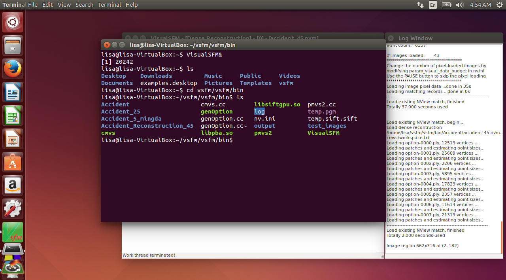

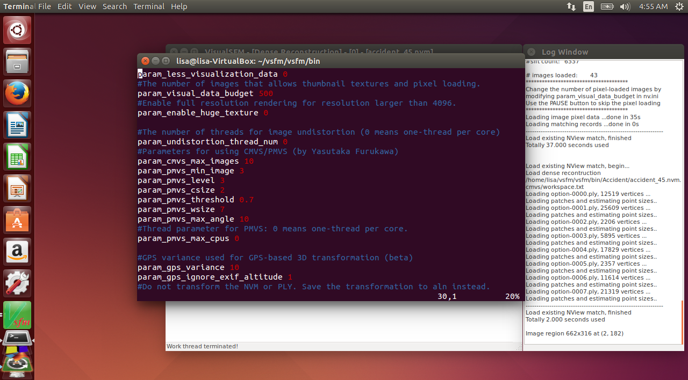

If you press tab, you can see your dense reconstruction. Save an image of your reconstruction to use as a comparison at the end.

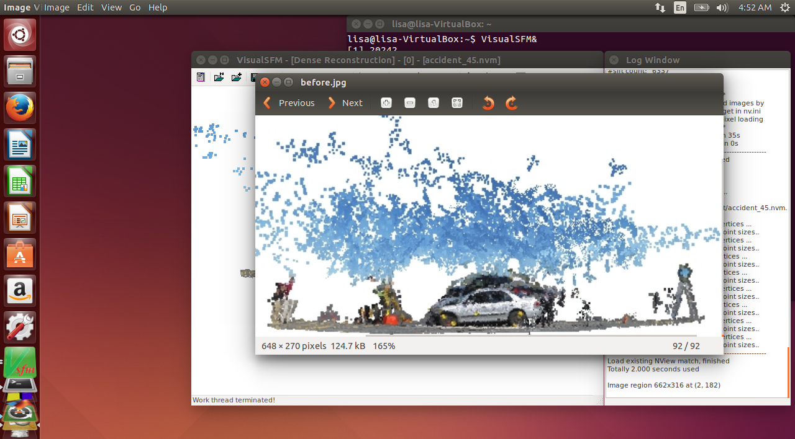

## Generate Masks

Download MATLAB. Open make_masks.m, making sure that you are in the same directory as make_masks.m on the left-hand side. Edit the fields to where your images are, and then run the script.

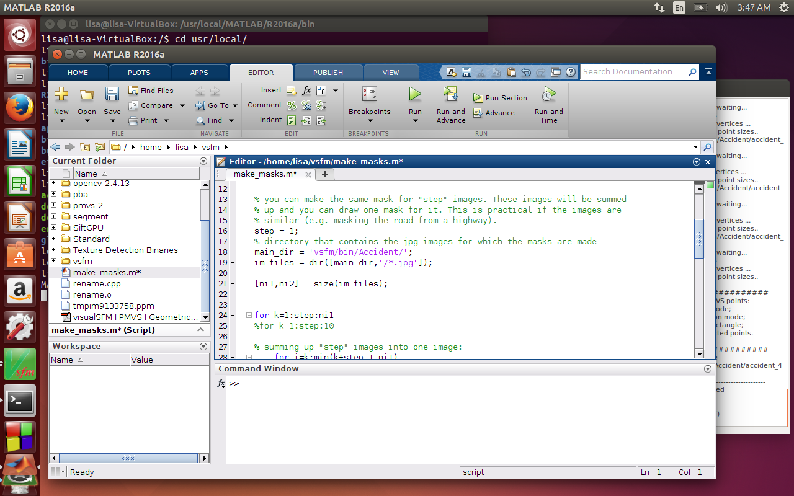

The following window should pop up. Click to outline the part that you want to mask out (I masked out people), and right click to finish the outline. After a couple outlines, you should see a figure pop up that has the mask you have drawn. This image is automatically saved, so you don’t have to save the mask and you can keep going until you have drawn masks for all the images.

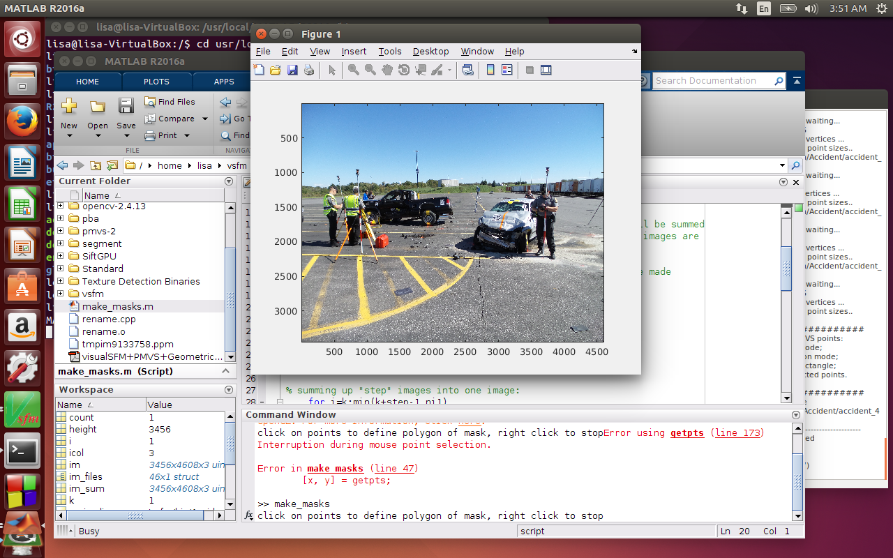

After all the masks have been drawn, they should appear in the folder with your images.

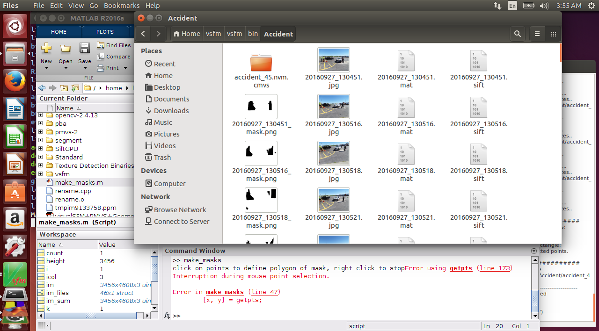

## Apply Masks with PMVS

Download OpenCV. Create a new project, and open rename.cpp as a source. Change the fields for the paths in blue to match your directories, as well as the width and height to match your images (you can find this under properties). The file full.txt is an intermediary step, but you can open it to look at the file names it found and debug your code if the masks folder is still empty.

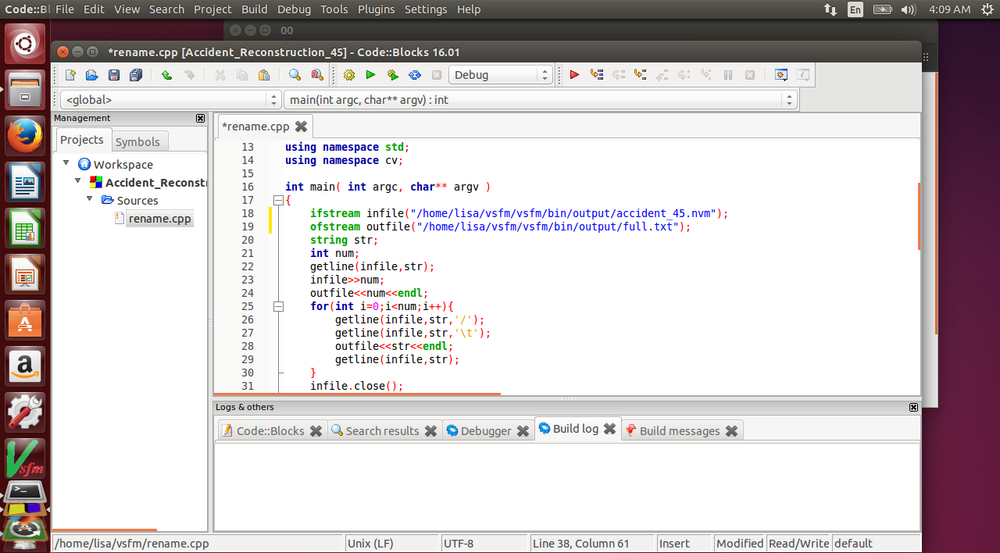

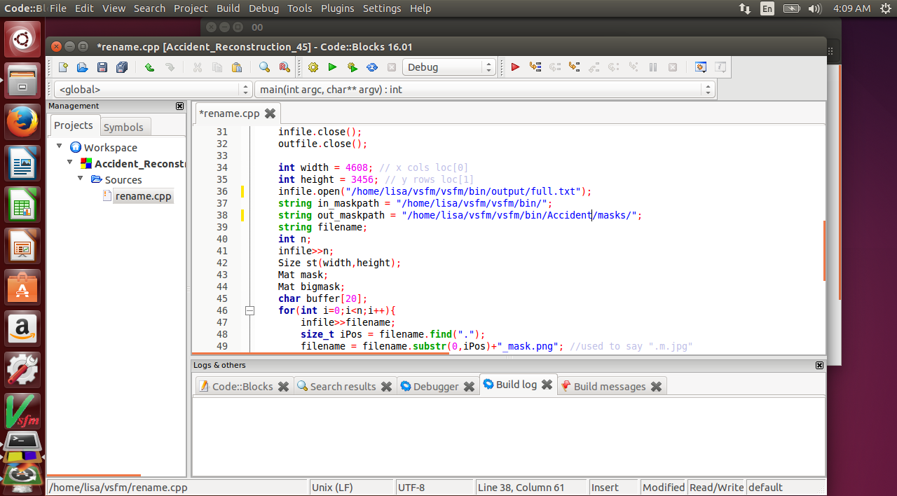

Create a new masks folder in your images directory. Make sure to press rebuild button before running the code, or it won’t run your changes. After you run the code, your masks folder should be filled with .pgm files, one for each of your masks that you produced earlier.

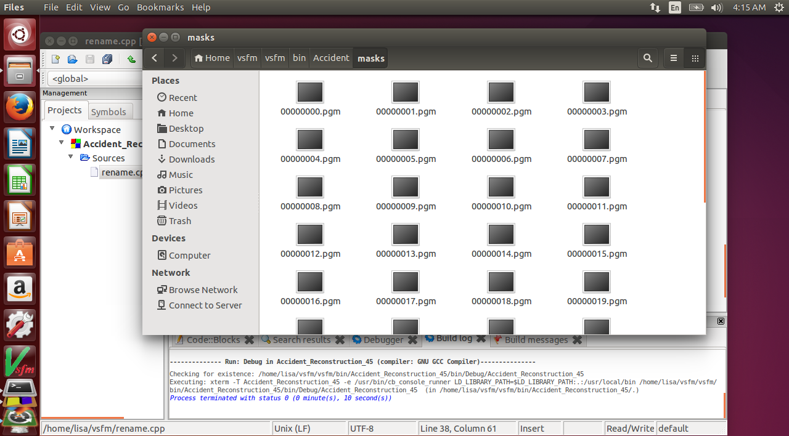

Copy the masks folder into your .nvm.cmvs/00 folder. 

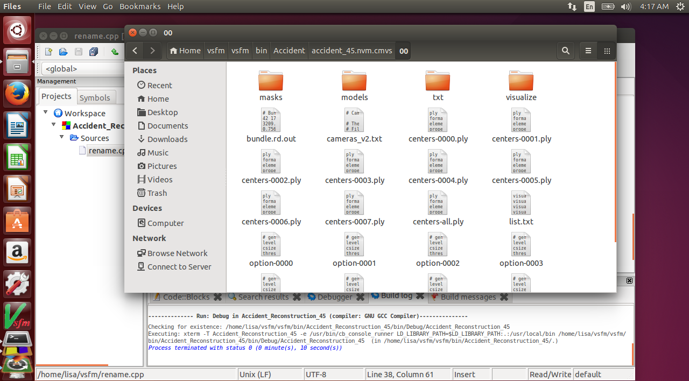

Look at the .nvm.cmvs/00 folder. Take note of how many option-000x files there are.

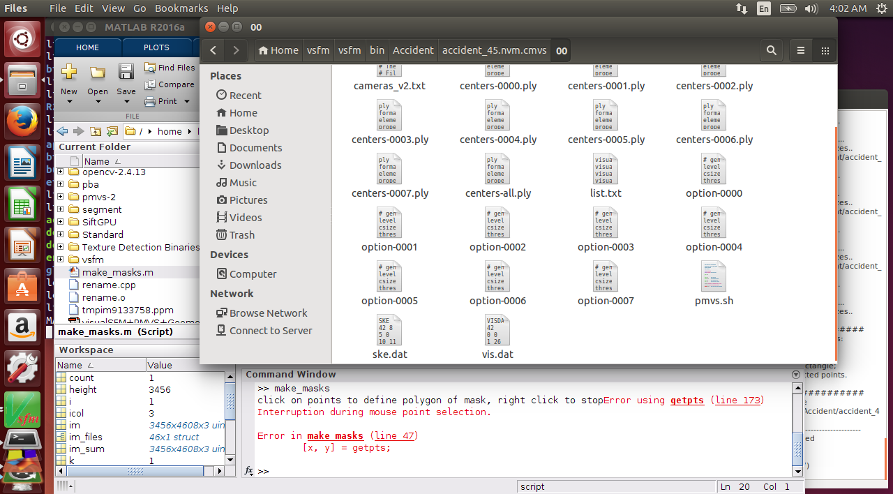

For every option-000x file, run pmvs2 on it from vsfm/bin. 

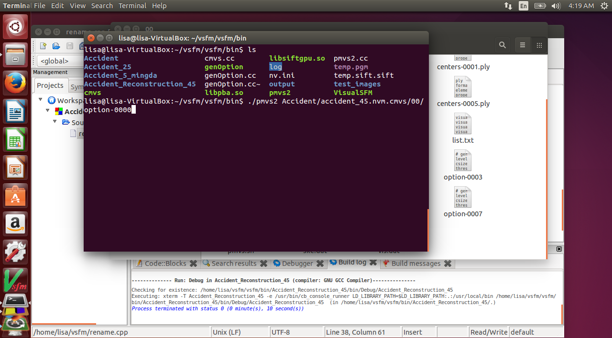

You should see some message about reading masks. If not, make sure you have the masks folder in the right place and as a .pgm format.

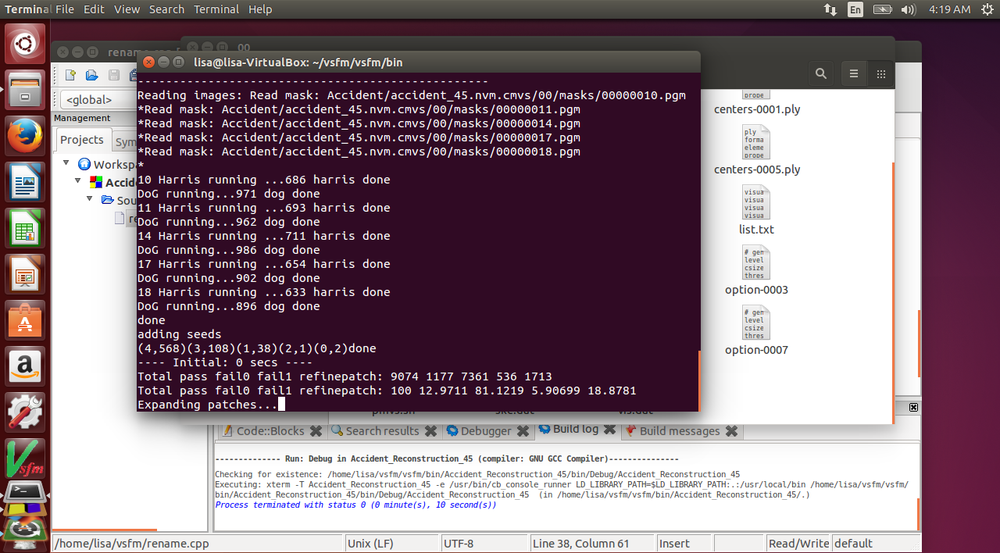

I have option-0000 through option-0007, so I will run this command for each of those.

## Construct New Dense Reconstruction

Make sure you have a workspace.txt file in your .nvm.cmvs file. If not, you may not have actually completed your dense reconstruction from the first step, so go back and try again.

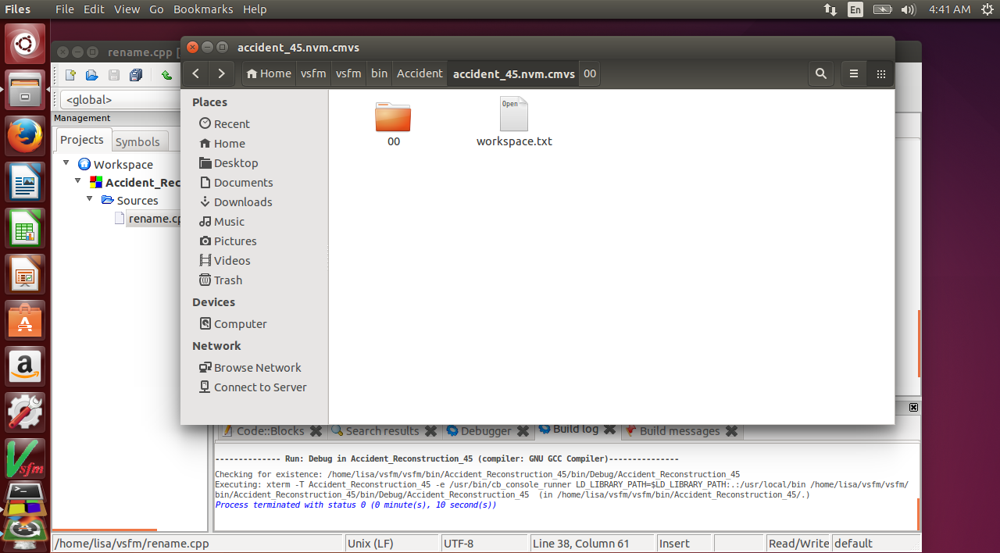

Open your .nvm file in VisualSFM with the Load NView Match button. Next, open workspace.txt from your .nvm.cmvs file with the Load NView Match button. If you press tab, you can see your new dense reconstruction.

You should see a new dense reconstruction with the masked parts removed!

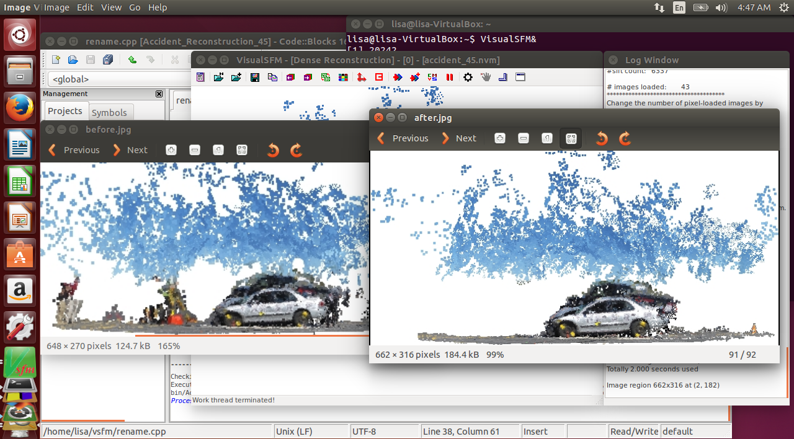

Comparing the before and after images, you can see that the details of the car became more precise in the after image from removing non-static parts of the set of images such as moving people.
